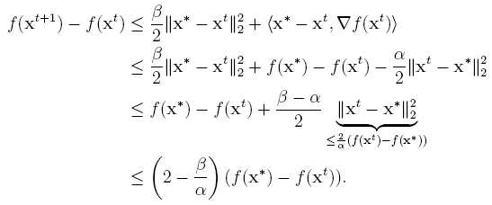

## Chapter 3 Non-Convex Projected Gradient Descent

### 3.1 Non-convex Projections

#### 3.1.1 Projecting into Sparse Vectors

In the following sparse linear regression example, applying projected gradient descent requires projections onto the set of $s$-sparse vectors i.e., $\prod_{B_0(s)}:=\{x\in R^p, \parallel x \parallel_0 \le s\}$.

**Lemma 3.1** For any vector $z\in R^p$, let $\delta$ be the permutation that sorts the coordinates of $z$ in decreasing order of magnitude, i.e., $\mid z_{\delta(1)}\mid \ge \mid z_{\delta(2)}\mid\ge\cdots\ge\mid z_{\delta(p)}\mid$. Then the vector $\hat{z}:=\prod_{B_0(s)}(z)$ is obtained by setting $\hat{z}_i=z_i$ if $\delta(i) \le s$ and $\hat{z}_i=0$ otherwise.

The support of a vector $x$ is denoted by $supp(x):=\{i:x_i\neq0\}$. A vector $x$ is referred to as $s$-sparse if $\mid supp(x)\mid \le s$.

##### Proof of Lemma 3.1

Since the function $x\rightarrow x^2$ is an increasing function on the positive half of the real line, we have $argmin_{x\in C} \parallel x-z \parallel_2 = argmin_{x\in C} \parallel x-z \parallel_2^2$. And the vector $\hat{z}:=\prod_{B_0(s)}(z)$ must satisfy $\hat{z}_i=z_i$ for all $i\in supp(\hat{z})$,  which means that if $\hat{z}_i$ is non-zero, then $\hat{z}_i=z_i$. Otherwise (when $\hat{z}_i$ is zero) we can decrease the objective value $\parallel \hat{z}-z \parallel_2^2$ by ensuring this. This gives us $\parallel \hat{z}-z \parallel_2^2=\sum_{i\notin supp(\hat{z})}z_i^2$. This is clearly minimized when $supp(\hat{z})$ has the coordinates of $z$ with largest magnitude. 

#### 3.1.2 Projecting into Low-rank Matrices

In the recommendation systems problem, before projecting onto the set of low rank matrices, we first define this problem formally. Consider matrices of a certain order, say $m\times n$ and let $C \subset R^{m \times n}$ be an arbitrary set of matrices. Then the projection operator $\prod_C(\cdot)$ is defined as follows: for any matrix $A\in R^{m \times n}$,

where $\parallel\cdot\parallel_F$ is the Frobenius norm over matrices. For low rank projections we require $C$ to be the set of low rank matrices $B_{rank}(r):=\{A\in R^{m \times n},rank(A)\le r\}$. And this projection can be done efficiently by performing a *Singular Value Decomposition* on the matrix $A$ and retaining the top $r$ singular values and vectors. The Eckart-Young-Mirsky theorem proves that this indeed gives us the projection.

**Theorem 3.2** (*Eckart-Young-Mirsky theorem*) For any matrix $A\in R^{m \times n}$, let $U\Sigma V^T$ be the singular value decomposition of $A$ such that $\Sigma=diag(\sigma_1, \sigma_2,\cdots,\sigma_{min(m,n)})$ where $\sigma_1\ge \sigma_2\ge\cdots\ge\sigma_{min(m,n)}$. Then for any $r\le min(m,n)$, the matrix $\hat{A}_{(r)}:=\prod_{B_{rank}(r)}(A)$ can be obtained as $U_{(r)}\Sigma_{(r)}V_{(r)}$ where $U_{(r)}:=[U_1U_2\cdots U_r],V_{(r)}:=[V_1V_2\cdots V_r]$, and $\Sigma=diag(\sigma_1, \sigma_2,\cdots,\sigma_r)$.

Theorem 3.2 actually could apply to any unitarily invariant norm including the Schatten norms and the operator norm. Notice that non-convex projections are not as nicely behaved as their convex counterparts, and none of the projections mentioned above satisfy projection properties I and II. This will pose a significant challenge while analyzing PGD-style algorithms for non-convex problems, since projection properties I and II are crucially used in all convergence proofs.

### 3.2 Restricted Strong Convexity and Smoothness

The simplest workaround to a non-convex problem with a non-convex constraint set is to convert the constraint set into a convex one, possibly by taking its convex hull, which is what relaxation methods do.

**Definition 3.1** (*Restricted Convexity*) A continuously differentiable function $f:R^p\rightarrow R$ is said to satisfy restricted convexity over a (possibly non-convex) region $C\subseteq R^p$ if for every $x,y\in C$ we have $f(y)\ge f(x) + \langle \nabla f(x),y-x\rangle$, where $\nabla f(x)$ is the gradient of $f$ at $x$.

A more general definition that extends to non-differentiable functions uses the notion of subgradient to replace the gradient in the above expression.

**Definition 3.2** (*Restricted Strong Convexity / Smoothness*) A continuously differentiable function $f:R^p\rightarrow R$ is said to satisfy $\alpha$-restricted strong convexity ($RSC$) and $\beta$-restricted strong smoothness ($RSS$) over a (possibly non-convex) region $C\subseteq R^p$ if for every $x,y\in C$ we have

As Figure 3.1 demonstrates, even non-convex functions can demonstrate the $RSC/RSS$ properties over suitable subsets. Conversely, functions that satisfy $RSC/RSS$ need not be convex. 

### 3.3 Generalized Projected Gradient Descent

The procedure of the generalized projected gradient descent algorithm (gPGD) for non-convex optimization problems is outlined in Algorithm 2. It is remarkably similar to the PGD procedure in Algorithm 1. However, a crucial difference is in the projections made. Whereas PGD utilized convex projections, the gPGD utilizes non-convex projections instead.

Denote that the optimal function value as $f^*=min_{x\in C}f(x)$ and any optimizer as $x^*\in C$ such that $f(x^*) = f^*$.

To simplify the presentation, assume that $\nabla f(x^*)=0$. This assumption is satisfied whenever the objective function is differentiable and the optimal point $x^*$ lies in the interior of the constraint set $C$. However, many sets such as $B_0(s)$ do not possess an interior and this assumption fails by default on such sets. Nevertheless, this assumption will greatly simplify the presentation as well as help us focus on the key issues. Moreover, convergence results can be shown without making this assumption too.

**Theorem 3.3** Let $f$ be a (possibly non-convex) function satisfying the $\alpha$-RSC and $\beta$-RSS properties over a (possibly non-convex) constraint set $C$ with $\frac{\beta}{\alpha}<2$. Let Algorithm 2 be executed with a step length $\eta=\frac{1}{\beta}$. Then after at most $T=O(\frac{\alpha}{2\alpha-\beta}log\frac{1}{\epsilon})$ steps, $f(x^T)\le f(x^*) +\epsilon$.

Note that the result holds even when the step length is set to values that are large enough but yet smaller than $\frac{1}{\beta}$. However, setting $\eta=\frac{1}{\beta}$ simplifies the proof and allows us to focus on the key concepts.

##### The proof of Theorem 3.3

Let $\Phi_t=f(x^{t+1})-f(x^*)$ be the potential function.

Since both $x^t,x^{t+1}\in C$ due to the projection steps, we apply the $\beta$-RSS property to them.

With the fact that $\eta=\frac{1}{\beta}$, we have

Unlike Algorithm 1, we resort to Projection Property-O (Lemma 2.2) instead to make all projections satisfy.
$$
\parallel x^* - z^{t+1} \parallel_2^2 \leq \parallel x^{t+1} - z^{t+1} \parallel_2^2
$$
Thus,

Since both $x^t,x^*\in C$, we apply the $\alpha$-RSC property to them in two ways. We have the second one because of the assumption $\nabla f(x^*)=0$.                                                                                                                                                                                                                                                                                                                                                                                                                                                                                         

Given the Restricted Strong Convexity / Smoothness convexity, we could do the simple manipulations with the two equations.

The above inequality tells us that the larger the gap between $f(x^*)$ and $f(x^t)$, the larger will be the drop in objective value in going from $x^t$ and $x^{t+1}$. Rearranging this gives
$$
f(x^{t+1})-f(x^t)\le(\frac{\beta}{\alpha}-2)(f(x^t)-f(x^*))\\
f(x^{t+1})-f(x^t)\le(\frac{\beta}{\alpha}-1)(f(x^t)-f(x^*))-(f(x^t)-f(x^*))\\
f(x^{t+1})-f(x^*)\le(\frac{\beta}{\alpha}-1)(f(x^t)-f(x^*))
$$
Since condition number is defined as $\kappa:=\frac{\beta}{\alpha}$, we have

Note that $\kappa\ge1$ and by assumption $\kappa=\frac{\beta}{\alpha}<2$, we always have $\kappa-1\in[0,1)$. And this proves the statement.

Therefore, we see that the condition number plays in crucial role in deciding the convergence rate of the algorithm. The analysis of the gPGD algorithm does require $\kappa<2$, while there is no restriction on $\kappa$ in the analysis of the PGD algorithm. It turns out that this restriction can be done away with for specific problems. And we will see that gPGD-style algorithm offer very good performance on practical machine learning and signal processing problems.